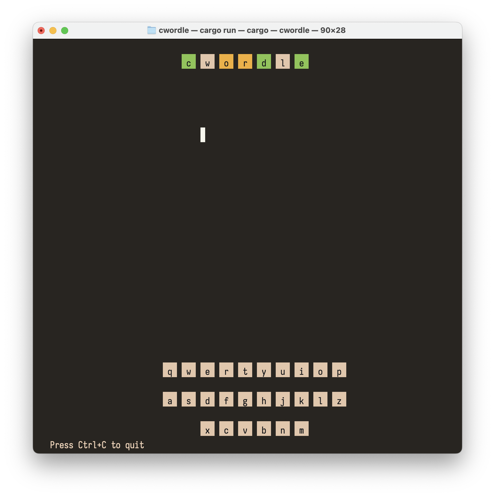
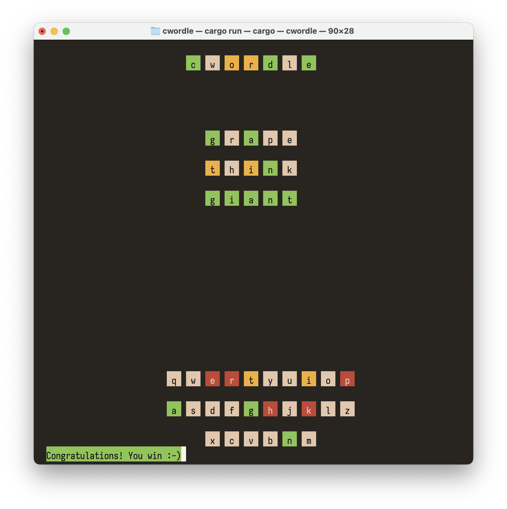
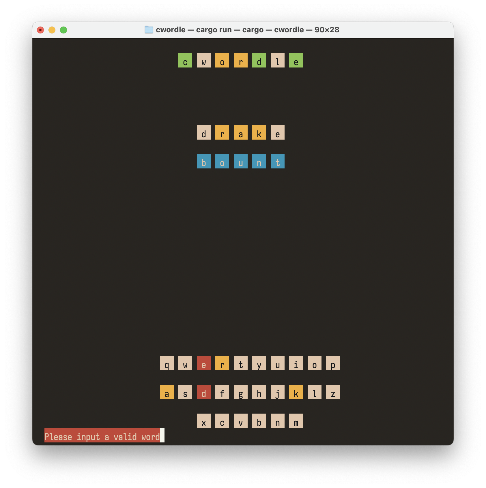

# cwordle

Play the popular game worldle in a terminal. Works with all ANSI terminals on Linux and Mac.

## Screenshots

Successfully guessing the word

Partway into playing a wordle

Entering an invalid word

Unsuccessful in guessing the word
