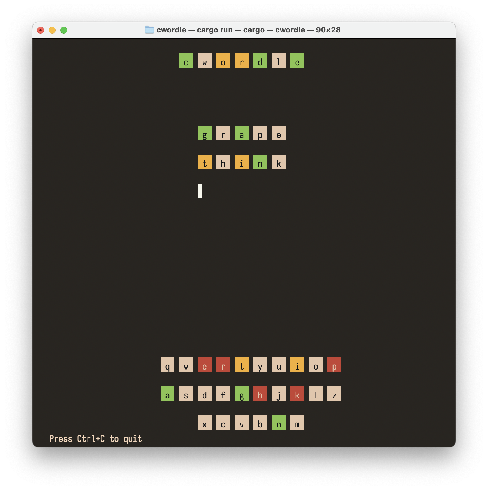

# cwordle

Play the popular game wordle in a terminal. Works with all ANSI terminals on Linux, Windows and Mac.

## Screenshots

Starting screen

Partway into playing a wordle

Winning the game

Entering an non dictionary word

Losing the game